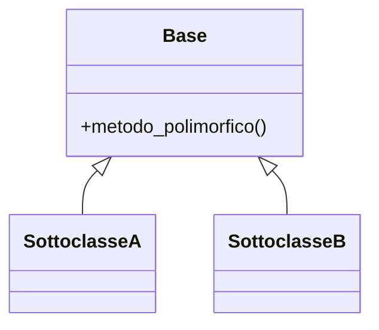

# Manuale tecnico

> Scritto per chi volesse **estendere** il programma (incluso il te di fra sei mesi).
> Spiega com'è fatto dentro: architettura, moduli, e soprattutto la gerarchia di classi.

## Architettura generale

_Come è organizzato il codice. Quali moduli, chi dipende da chi, dov'è la logica e
dov'è l'interfaccia. Una o due righe per modulo._

```
src/<progetto>/
├── __main__.py     ← avvio (python -m <progetto>)
├── cli.py          ← interfaccia a riga di comando
└── core/           ← logica di dominio (indipendente dalla CLI)
    ├── base.py     ← classe base astratta
    └── ...         ← sottoclassi concrete
```

## La gerarchia di classi

_Il pezzo più importante di questo documento. Spiega la gerarchia di ereditarietà:
chi è la classe base, quali le sottoclassi, quale metodo è polimorfico._

Diagramma (Mermaid o ASCII):



## Come aggiungere una nuova sottoclasse

_Procedura concreta: "per aggiungere un nuovo X, crea una classe che eredita da Y e
ridefinisce il metodo Z; poi registrala in…". Se è facile farlo, l'architettura è buona._

## Dipendenze esterne

_Quali librerie usi e perché._
